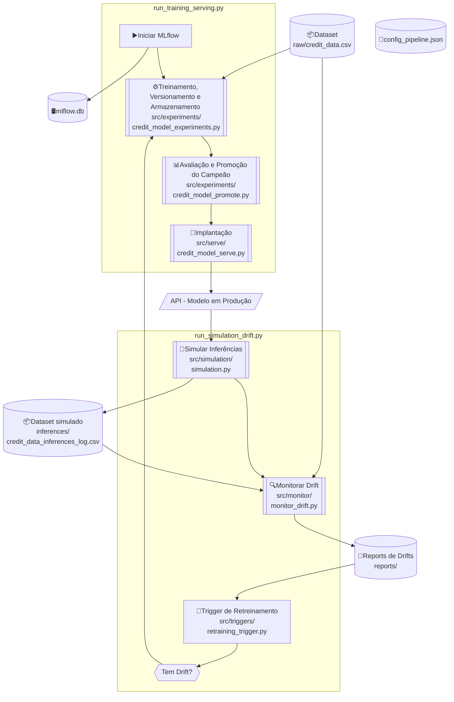

# MLOPS - Classificação de Crédito

Projeto de trabalho final realizado pelo aluno Luiz A. M. Garcia dentro da disciplina ECD15 de MLOPS.

O código do projeto está em https://github.com/lamgarcia/ufrgs-ecd15


## 📦Dataset

O dataset escolhido é de  **Classificação de Crédito** de cliente para compra de bens. O rótulo é **Status** e tem o valor *good* (bom crédito) e *bad* (mau crédito).

Repositório do dataset (buscar pelo item' credit_data'):
https://vincentarelbundock.github.io/Rdatasets/articles/data.html

Pode ser baixado diretamente do link: https://vincentarelbundock.github.io/Rdatasets/csv/modeldata/credit_data.csv

### Features 

1. rownames - Número ou identificador da linha.
2. **Status** - Classificação da situação de crédito do cliente (*good*, *bad*) .
3. Seniority - Tempo de experiência profissional (número em anos).
4. Home - Situação de moradia (*rent, owner, parents, priv, other*)
5. Time - Tempo de relacionamento com a instituição financeira (número de meses).
6. Age - Idade do cliente (anos).
7. Marital - Estado Civil (*single, separated, married, widow*).
8. Records - Possui registros negativos de crédito (*yes, no*).
9. Job - Tipo de ocupação profissional (*fixed, frelancer, partime*).
10. Expenses - Despesas mensais (dólares).
11. Income - Renda mensal (dólares).
12. Assets - valor dos ativos como bens  e investimentos(dólares).
13. Debt - Dívida atual do cliente (dólares).
14. Aunt - Valor do crédito solicitado (dólares).
15. Price  - Valor total do bem adquirido (dólares).
### Valores limites

1. rownames: [1:4454]
2. Status: ['good', 'bad']
3. Seniority: [0:48]
4. Home: ['rent', 'owner', 'parents', 'priv', 'other', 'ignore']
5. Time: [6:72]
6. Age: [18:68]
7. Marital: ['married', 'widow', 'single', 'separated', 'divorced']
8. Records: ['no', 'yes']
9. Job: ['freelance', 'fixed', 'partime', 'others']
10. Expenses: [35:180]
11. Income: [6.0:959.0]
12. Assets: [0.0:300000.0]
13. Debt: [0.0:30000.0]
14. Amount: [100:5000]
15. Price: [105:11140]

### Resumo estatístico 

|       | rownames | Seniority | Time  | Age   | Expenses | Income | Assets  | Debt    | Amount  | Price   |
| ----- | -------- | --------- | ----- | ----- | -------- | ------ | ------- | ------- | ------- | ------- |
| count | 4454     | 4454      | 4454  | 4454  | 4454     | 4073   | 4407    | 4436    | 4454    | 4454    |
| mean  | 2227.5   | 7.99      | 46.44 | 37.08 | 55.57    | 141.69 | 5403.98 | 343.03  | 1038.92 | 1462.78 |
| std   | 1285.9   | 8.17      | 14.66 | 10.98 | 19.52    | 80.75  | 11574.4 | 1245.99 | 474.55  | 628.13  |
| min   | 1        | 0         | 6     | 18    | 35       | 6      | 0       | 0       | 100     | 105     |
| 25%   | 1114.25  | 2         | 36    | 28    | 35       | 90     | 0       | 0       | 700     | 1117.25 |
| 50%   | 2227.5   | 5         | 48    | 36    | 51       | 125    | 3000    | 0       | 1000    | 1400    |
| 75%   | 3340.75  | 12        | 60    | 45    | 72       | 170    | 6000    | 0       | 1300    | 1691.5  |
| max   | 4454     | 48        | 72    | 68    | 180      | 959    | 300000  | 30000   | 5000    | 11140   |


## 📁 Estrutura do projeto

```bash
├── README.md                  # documentação do projeto
├── requirements.txt           # imports do python
├── config_pipeline.json       # configurações principais do pipeline
├── run_training_serving.py    # run mlflow e codigo de treinamento e serving 
├── run_simulation_drift.py    # run simula inferencia, monitor de drift e trigger
├── stop_mlflow.py             # codigo auxiliar para parar mlflow se preciso
├── mlflow.db                  # base dados do mlflow criada na execução do mlflow

├── data                       
│   ├── raw                    # dataset principal do modelo
│   │   └── credit_data.csv
│   └── inferences             # dataset com inferências simuladas
│       └── credit_data_inferences_log.csv
 
├── src
    ├── experiments
    │   ├── credit_model_experiments.py # experimentos de treinamento dos models
    │   └── credit_model_promote.py     # promove modelo campeão a produção
	├── serve
    │   └── credit_model_serve.py       # sobe serviço de api com modelo campeão 
	├── monitor
    │   └── monitor_drift.py            # monitora drifts e salva em \reports
    ├── simulation
    │   └── simulation.py               # cria dataset de inferencias simuladas
    └── triggers
        └── retraining_trigger.py       # verifica \reports e aciona retreinamento

├── reports                     # pasta com reports de drift do evidently
│   ├── report_classdrift.html
│   ├── report_classdrift.json  # class drifts em json para a trigger
│   ├── report_datadrift.html
│   └── report_datadrift.json   # data drifts em json para a trigger

├── runs   
│   └── runs.log                # logs dos pythons executados no pipeline (\src)
        
├── mlruns/                    # runs do mlflow, criado após inicialização
```


## 📝Arquivo de configuração (config_pipeline.json)

Arquivo **config_pipeline.json** é um arquivo de configuração utilizado por vários códigos do modelo. Facilita alteração e parâmetros para  execução do pipeline e permite maior flexibilidade sem alterar os códigos.  Através dele é possível definir a acurácia do dataset da simulação para que possa ser disparado o trigger de re-treinamento em caso de drift superior. 


```bash
config_pipeline.json:

{
   "mlflow":{
      "mlflow_uri":"sqlite:///mlflow.db",
      "mlflow_experiment":"CreditData_Experiments"
   },
   "files":{
      "dataset":"data/raw/credit_data.csv",
      "datadrift_html":"reports/report_datadrift.html",
      "datadrift_json":"reports/report_datadrift.json",
      "classdrift_html":"reports/report_classdrift.html",
      "classdrift_json":"reports/report_classdrift.json",
      "inferences_log":"data/inferences/credit_data_inferences_log.csv",
      "runs_log":"runs/runs.log"
   },
   "experiments":{
      "staging_threshold":0.70
   },
   "drift":{
      "min_f1_score":0.65,
      "min_data_share":1,
      "code_retraining":"run_training_serving.py"
   },
   "simulation":{
       "acuracia":0.5,
       "amostras":2000
   }
}
```

## 🔄Pipeline

## 🛠️Ferramentas 


No Pipeline foram utilizadas as seguintes Ferramentas:
- Rastreamento, Versionamento, e Armazenamento de Artefatos: MLFlow 
- Treinamento e métricas dos modelos: SKLearn e XGboost 
- Disponibilização do Modelo via API: MLFlow
- Monitoramento de Drifts: Evidently AI
- Log das etapas da execução: Logging
- Controle de versão do código: GitLab  

## 🤖Modelos, Resultados e Métricas
 
Como é um problema de classificação de crédito, foram utilizados os modelos Random Forest, XGBoost e Logistic Regression com parâmetros diversos para avaliação. Abaixo os F-Scores de uma execução de treinamento.

|                                                                              |                    |
| ---------------------------------------------------------------------------- | ------------------ |
| **Modelo e parâmetros**                                                      | **f1-score**       |
| RandomForest_{'n_estimators': 100, 'max_depth': 10, 'min_samples_split': 10} | 0.859896219421794  |
| RandomForest_{'n_estimators': 100, 'max_depth': 10, 'min_samples_split': 2}  | 0.8584202682563339 |
| XGBoost_{'n_estimators': 100, 'max_depth': 6, 'learning_rate': 0.2}          | 0.8564885496183207 |
| RandomForest_{'n_estimators': 50, 'max_depth': 10, 'min_samples_split': 10}  | 0.8558692421991084 |
| RandomForest_{'n_estimators': 50, 'max_depth': 30, 'min_samples_split': 10}  | 0.8552036199095022 |
| XGBoost_{'n_estimators': 100, 'max_depth': 6, 'learning_rate': 0.1}          | 0.8551829268292683 |
| LogisticRegression_{'C': 3.0, 'penalty': 'l2', 'solver': 'lbfgs'}            | 0.8550404709345106 |
| XGBoost_{'n_estimators': 150, 'max_depth': 9, 'learning_rate': 0.2}          | 0.8549382716049383 |
| LogisticRegression_{'C': 0.1, 'penalty': 'l2', 'solver': 'lbfgs'}            | 0.8548148148148148 |
| RandomForest_{'n_estimators': 100, 'max_depth': 10, 'min_samples_split': 5}  | 0.8537666174298375 |
| RandomForest_{'n_estimators': 50, 'max_depth': 10, 'min_samples_split': 2}   | 0.85331347728965   |
| RandomForest_{'n_estimators': 50, 'max_depth': 20, 'min_samples_split': 10}  | 0.8530734632683659 |
| RandomForest_{'n_estimators': 100, 'max_depth': 20, 'min_samples_split': 2}  | 0.8526315789473684 |
| RandomForest_{'n_estimators': 50, 'max_depth': 20, 'min_samples_split': 5}   | 0.8522130532633159 |
| LogisticRegression_{'C': 2.0, 'penalty': 'l2', 'solver': 'lbfgs'}            | 0.8518242740134029 |
| XGBoost_{'n_estimators': 200, 'max_depth': 9, 'learning_rate': 0.2}          | 0.8516228748068007 |
| RandomForest_{'n_estimators': 100, 'max_depth': 30, 'min_samples_split': 10} | 0.8513513513513513 |
| XGBoost_{'n_estimators': 150, 'max_depth': 6, 'learning_rate': 0.1}          | 0.8509984639016898 |
| RandomForest_{'n_estimators': 100, 'max_depth': 30, 'min_samples_split': 5}  | 0.8507126781695424 |
| XGBoost_{'n_estimators': 100, 'max_depth': 9, 'learning_rate': 0.1}          | 0.850609756097561  |
| LogisticRegression_{'C': 1.0, 'penalty': 'l2', 'solver': 'lbfgs'}            | 0.8505917159763313 |
| XGBoost_{'n_estimators': 200, 'max_depth': 6, 'learning_rate': 0.1}          | 0.8503453568687643 |
| RandomForest_{'n_estimators': 100, 'max_depth': 20, 'min_samples_split': 5}  | 0.8502994011976048 |
| XGBoost_{'n_estimators': 150, 'max_depth': 9, 'learning_rate': 0.1}          | 0.8498845265588915 |
| RandomForest_{'n_estimators': 100, 'max_depth': 20, 'min_samples_split': 10} | 0.8489857250187829 |
| RandomForest_{'n_estimators': 50, 'max_depth': 30, 'min_samples_split': 5}   | 0.8489425981873112 |
| RandomForest_{'n_estimators': 50, 'max_depth': 10, 'min_samples_split': 5}   | 0.8489314664701547 |
| XGBoost_{'n_estimators': 100, 'max_depth': 9, 'learning_rate': 0.2}          | 0.8488104374520338 |
| XGBoost_{'n_estimators': 200, 'max_depth': 9, 'learning_rate': 0.3}          | 0.8485780169100692 |
| LogisticRegression_{'C': 0.01, 'penalty': 'l2', 'solver': 'lbfgs'}           | 0.8481291269258987 |
| XGBoost_{'n_estimators': 150, 'max_depth': 9, 'learning_rate': 0.3}          | 0.847457627118644  |
| XGBoost_{'n_estimators': 200, 'max_depth': 12, 'learning_rate': 0.2}         | 0.8472755180353031 |
| XGBoost_{'n_estimators': 200, 'max_depth': 9, 'learning_rate': 0.1}          | 0.8465690053970701 |
| RandomForest_{'n_estimators': 50, 'max_depth': 20, 'min_samples_split': 2}   | 0.8457486832204665 |
| XGBoost_{'n_estimators': 100, 'max_depth': 9, 'learning_rate': 0.3}          | 0.8457405986185725 |
| XGBoost_{'n_estimators': 150, 'max_depth': 6, 'learning_rate': 0.2}          | 0.8457405986185725 |
| RandomForest_{'n_estimators': 100, 'max_depth': 30, 'min_samples_split': 2}  | 0.8456883509833586 |
| XGBoost_{'n_estimators': 100, 'max_depth': 12, 'learning_rate': 0.1}         | 0.8453292496171516 |
| XGBoost_{'n_estimators': 100, 'max_depth': 6, 'learning_rate': 0.3}          | 0.8450920245398773 |
| XGBoost_{'n_estimators': 150, 'max_depth': 12, 'learning_rate': 0.1}         | 0.8448540706605223 |
| RandomForest_{'n_estimators': 50, 'max_depth': 30, 'min_samples_split': 2}   | 0.8444108761329305 |
| XGBoost_{'n_estimators': 150, 'max_depth': 12, 'learning_rate': 0.2}         | 0.8440366972477065 |
| XGBoost_{'n_estimators': 100, 'max_depth': 12, 'learning_rate': 0.3}         | 0.8437259430331023 |
| XGBoost_{'n_estimators': 150, 'max_depth': 12, 'learning_rate': 0.3}         | 0.8433179723502304 |
| XGBoost_{'n_estimators': 200, 'max_depth': 6, 'learning_rate': 0.3}          | 0.8433179723502304 |
| XGBoost_{'n_estimators': 200, 'max_depth': 6, 'learning_rate': 0.2}          | 0.8428351309707242 |
| XGBoost_{'n_estimators': 100, 'max_depth': 12, 'learning_rate': 0.2}         | 0.8421052631578947 |
| XGBoost_{'n_estimators': 200, 'max_depth': 12, 'learning_rate': 0.3}         | 0.8417818740399385 |
| XGBoost_{'n_estimators': 150, 'max_depth': 6, 'learning_rate': 0.3}          | 0.8413793103448276 |
| XGBoost_{'n_estimators': 200, 'max_depth': 12, 'learning_rate': 0.1}         | 0.8407350689127105 |

## 🚀Execução do Pipeline

##### Clonar o projeto
O projeto foi executado em ambiente Windows, pode ser necessário ajustes para Linux ou Mac.

##### Instalação dos Módulos do Python** 
``` bass
python -m pip install --upgrade pip
pip install -r requirements.txt
```
##### Setar a variável de ambiente para execução do MLFLOW (no Windows)
``` bash
setx MLFLOW_TRACKING_URI "sqlite:///mlflow.db"
```
##### Iniciar serviço do MLFLOW
``` bash
mlflow ui --backend-store-uri sqlite:///mlflow.db
```
##### Treinar e Servir
```bash
python run_training_serving.py
```
##### Simular serving, monitoramento e trigger de retreinamento
``` bash
python run_simulation_drift.py
```


## ✅Considerações 

Neste trabalho foi implementado um Pipeline de MLOPS completo: 
- treinamento
- versionamento
- armazenamento de modelo
- avaliação dos modelos
- promoção do campeão em f1-score
- implantação do modelo vencedor  via API
- armazenamento das inferências do modelo em produção
- monitoramento de drift
- trigger para retreinamento em caso de drifts. 

Também foi utilizado arquivo de configuração global para facilitar a execução do pipeline com outros parâmetros e log das execuções em arquivo específico para consulta posterior.
